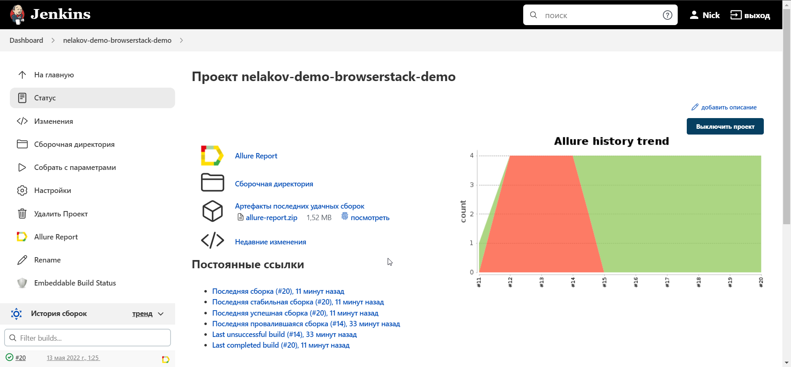
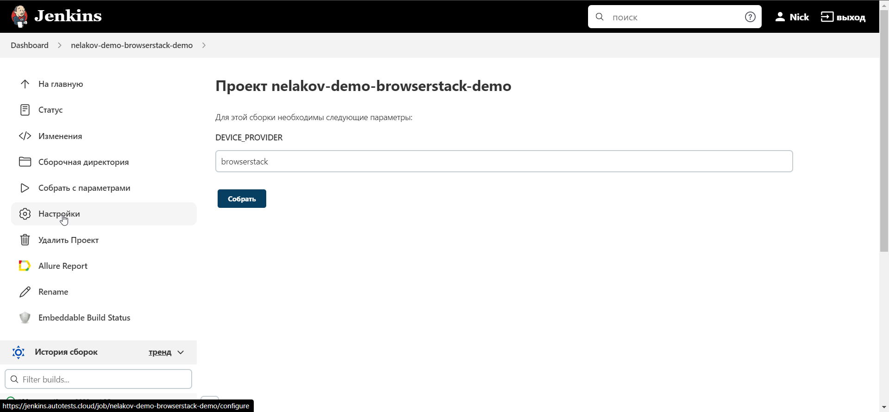
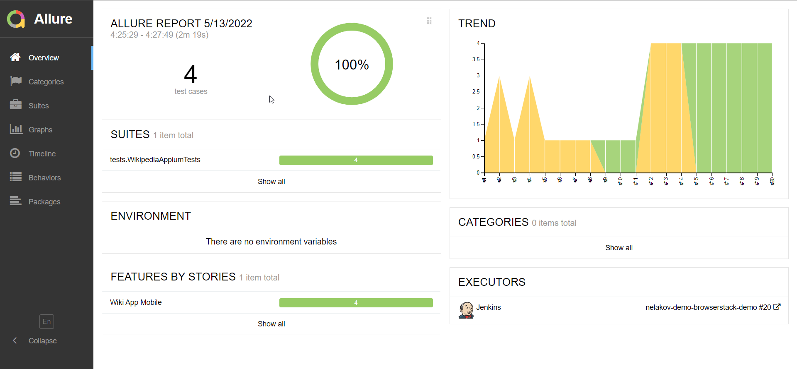
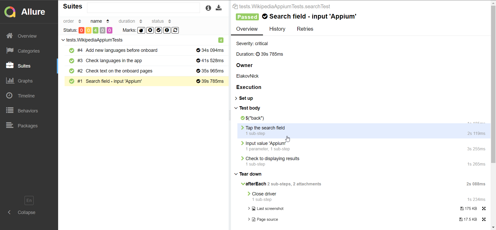

## Wikipedia (android mobile app) automated UI tests

<p  align="left">
<code>

</code>
</p>

## :heavy_check_mark: Test Cases:
> Automation mobile <code>UI</code> tests
- :white_check_mark: Onboarding (4 screens)
- :white_check_mark: Search by query
- :white_check_mark: Add new language
- :white_check_mark: Check language

## :gear: Technology stack

<p  align="left">
<code>


</code>
</p>

---
## :heavy_check_mark: Description

Automation tests of the onboarding screen in the Wikipedia mobile application.
The *_Owner_* library is used to configure the test run.
The device configuration is set in a config file, and when tests running, a parameter is used to select a specific configuration file.
The tests work without change to the code base:

- [X] Browserstack mobile farm (Remote)
- [X] Emulator via Android Studio (Local)
- [X] Samsung the real mobile device via USB (Local)


## :pilot: How to run tests?
```
In the resources/configuration directory, 
there are config files with parameters for launch tests 
in browserstack / emulator/ mobile environments
```
### Example for Browserstack
- Create config file for Browserstack

``
src/test/resources/config/browserstack.properties
``
- Add data
```bash
  user=wixavixdmosoftco_f8IUCT (from Browserstack)
  key=GDBsxkqPopnGtvbwhoLM (from Browserstack)
  app=bs://44fe6139d9a4b992f48376b347c58bcab9dc1d63 (Upload your .APK file to Browserstack then give your app)
  device=Samsung Galaxy S22 Plus (any mobile in the Browserstack)
  os_version=12.0 
  project=First Java Project (any)
  build=browserstack-build-1 (any)
  name=first_test (any)
  url=http://hub.browserstack.com/wd/hub 
```

###  Browserstack

```bash 
gradle clean test -DdeviceProvider=browserstack
```
### Example for Emulator

- Create config file for Emulator
``
src/test/resources/config/emulator.properties
``
- Add data
```bash
platformName=Android
deviceName=Pixel_4_API_30
platformVersion=11.0
locale=en
language=en
appPackage=org.wikipedia.alpha
appActivity=org.wikipedia.main.MainActivity
appUrl=https://github.com/wikimedia/apps-android-wikipedia/releases/download/latest/app-alpha-universal-release.apk?raw=true
appPath=src/test/resources/apk/app-alpha-universal-release.apk
serverUrl=http://localhost:4723/wd/hub
```
<p  align="left">
<code>

</code>
</p>

###  Emulator via Android Studio

- Launch Appium on port 4723

```bash 
gradle clean test -DdeviceProvider=emulator
```
<p  align="left">
<code>

</code>
</p>


### Example for Mobile the same how like Emulator

- Create config file for Emulator
  ``
  src/test/resources/config/mobile.properties
  ``
###  Samsung the real mobile device via USB

- Launch Appium on port 4723

```bash 
gradle clean test -DdeviceProvider=mobile
```
<p  align="left">
<code>

</code>
</p>


[To table of contents ⬆](#table of contents)

### Usually, tests run on Browserstack or Selenoid via Appium.

>Appium is an open source test automation framework for use with native, hybrid and mobile web apps. It drives iOS, Android, and Windows apps using the WebDriver protocol.

>Browserstack is cloud web and mobile testing platform that provides developers with the ability to test their websites and mobile applications across on-demand browsers, operating systems and real mobile devices.

>Selenoid is one of implementation of original Selenium hub. It is using Docker to launch browsers.


#  Jenkins
>Jenkins – an open source automation server which enables developers around the world to reliably build, test, and deploy their software

## Jenkins job
Example of Jenkins job that executes tests
<a target="_blank" href="https://jenkins.autotests.cloud/job/nelakov-demo-browserstack-demo/">click here to open jenkins job</a>
<p  align="left">
<code>

</code>
</p>
## Jenkins parameters
You can change this params to run test on different environments, servers, etc...

<p  align="left">
<code>

</code>
</p>

# :bar_chart: Allure
> Allure Framework is a flexible lightweight multi-language test report tool that not only shows a very concise representation of what have been tested in a neat web report form, but allows everyone participating in the development process to extract maximum of useful information from everyday execution of tests.


## Allure overview
> Different charts, metrics and statistic to easily analyze tests result
<p  align="left">
<code>

</code>
</p>

## Allure test result
> Here is a result of test executing.
<p  align="left">
<code>

</code>
</p>

